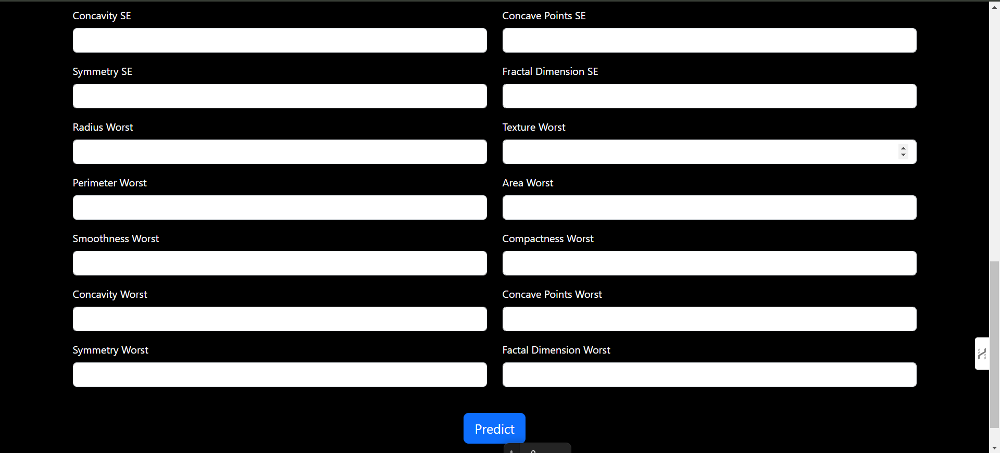

Breast Cancer Prediction Web Application
Overview
This project is a Breast Cancer Prediction System built using a Random Forest Classifier. The system takes a set of input features (such as tumor characteristics) and predicts whether the tumor is cancerous or not cancerous. The model is deployed as a Flask web application where users can input data and receive predictions in real-time.

The code demonstrates the integration of machine learning (Random Forest) with a web application built using Flask.

Project Structure:
breast_cancer_prediction/
├── app.py                # Flask web application
├── model.py              # Contains the classifier model code
├── classifier_rf.pkl     # Pre-trained Random Forest model
├── static/               # Folder for static files (CSS, JS, etc.)
├── templates/            # Folder for HTML templates
│   └── index.html        # Main HTML page for the app
├── requirements.txt      # List of Python dependencies
├── README.md             # Project documentation
└── assets/               # Folder containing screenshots (e.g., of the app in action)
    ├── screenshot1.png
    ├── screenshot2.png
    └── screenshot3.png

Prerequisites
To run this project, you will need Python 3.x installed, as well as the required Python packages listed below.

Required Libraries
Flask: Web framework for building the app.
NumPy: Used for numerical operations.
Scikit-learn: Machine learning library used for the Random Forest Classifier.
Pickle: For saving and loading the trained model.
You can install the required libraries by running:

pip install -r requirements.txt
requirements.txt
makefile
Copy code
Flask==2.1.1
numpy==1.21.0
scikit-learn==1.0.2
How It Works
The application is built using Flask, a lightweight Python web framework. It allows users to interact with the model by inputting values corresponding to tumor features, such as radius, texture, smoothness, and others. The trained Random Forest Classifier model then predicts whether the tumor is cancerous or not.

Prediction Process
The user inputs 30 numerical features related to a breast tumor.
These features are passed to the trained Random Forest Classifier model.
The model predicts whether the tumor is cancerous (1) or not cancerous (0).
The result is displayed to the user on the web page.
Input Example:
Here’s an example of the input data that the classifier expects (30 numerical values):

python
Copy code
input_text = (-0.4976419 ,  0.61365274, -0.49813131, -0.53102815, -0.57694824,
              -0.17494424, -0.36215622, -0.284859  ,  0.43345165,  0.17818232,
              -0.36844966,  0.55310406, -0.31671104, -0.40524636,  0.04025752,
              -0.03795529, -0.18043065,  0.16478901, -0.12170969,  0.23079329,
              -0.50044002,  0.81940367, -0.46922838, -0.53308833, -0.04910117,
              -0.04160193, -0.14913653,  0.09681787,  0.10617647,  0.49035329)
Prediction Example:
The input data is converted to a numpy array and passed to the classifier:

python
Copy code
np_df = np.asarray(input_text)
prediction = classifier_rf.predict(np_df.reshape(1,-1))

if prediction[0] == 1:
    print("Cancerous")
else:
    print("Not Cancerous")
Running the Application
Clone the Repository: First, clone the repository to your local machine:

bash
Copy code
git clone https://github.com/Duvvuridurgaprasad28/Breast-Cancer-Prediction.git
cd Breast-Cancer-Prediction
Install Dependencies: Install the required Python libraries using the requirements.txt file:

bash
Copy code
pip install -r requirements.txt
Run the Flask App: After installing the dependencies, run the Flask application using the following command:

bash
Copy code
python app.py
Access the Web Application: Open your web browser and go to http://127.0.0.1:5000/ to access the app.

Screenshots
Here are a few screenshots of the web application in action:

## Screenshots

Here are a few screenshots of the web application in action:

- **Screenshot 1**: Home page where the user can input the tumor characteristics.
  

- **Screenshot 2**: Prediction result showing whether the tumor is cancerous or not.
  

- **Screenshot 3**: Example of the prediction results page.
  

Contributing
If you'd like to contribute to this project, feel free to fork the repository, make your changes, and submit a pull request.

License
This project is licensed under the MIT License - see the LICENSE file for details.

